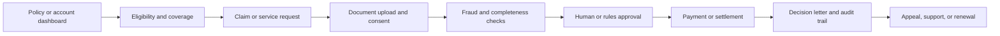
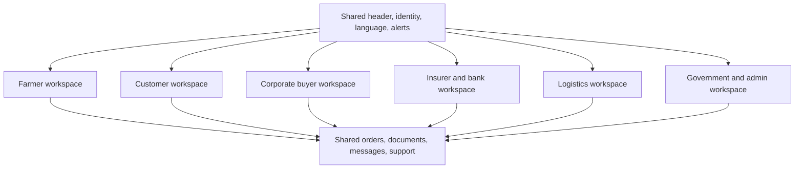

# AFRERA Product Ecosystem Blueprint

**Status:** Implementation blueprint for the existing React/Vite + Node/Express platform
**Audience:** Product, design, frontend, backend, QA, security, and operations teams
**Decision rule:** A capability is production-ready only when its UI, API, persistence, authorization, observability, tests, and recovery path are verified together.

## 1. Product North Star

AFRERA is a role-aware operating system for commerce, agriculture, finance, insurance, logistics, and enterprise operations. The experience should feel like one product even when a user moves between a marketplace, a booking workflow, a policy claim, or a farmer dashboard.

Every workflow follows the same six-state contract:

1. Discover: explain the option, owner, price basis, availability, and trust signals.
2. Compare: expose meaningful differences, fees, constraints, and cancellation or claim rules.
3. Commit: confirm identity, permissions, terms, quantities, dates, and totals before write operations.
4. Pay or submit: use an idempotent server operation with a visible processing state.
5. Confirm: show a durable reference, next action, receipt or document, and support path.
6. Operate: provide status, history, alerts, exports, and recovery actions.

No screen may imply success from a client-only state. Confirmation must come from the backend response.

## 2. Cross-Industry Benchmark Matrix

| Capability | E-commerce benchmark | Airline / hotel benchmark | Banking / insurance benchmark | Agriculture benchmark | AFRERA standard |
|---|---|---|---|---|---|
| Discovery | Search, filters, availability, recommendations | Origin/destination, dates, occupancy, fare class | Product eligibility and risk fit | Crop, grade, origin, season, quantity | One search model with domain-specific filters and plain-language empty states |
| Comparison | Total landed price, delivery promise, reviews | Fare rules, baggage, cancellation, room inclusions | APR/premium, exclusions, repayment or claim limits | Grade, packing, lot age, cold-chain promise | Compare totals and constraints before commitment |
| Identity | Account, saved addresses, order history | Traveller profiles and loyalty | KYC, MFA, consent, delegated authority | Farmer/FPO identity, land and certification evidence | Reusable identity, consent, and role policy across domains |
| Checkout / booking | Cart, address, tax, payment, confirmation | Hold, passenger/guest details, payment, ticket/voucher | Application, documents, review, approval | Lot reservation, pickup, invoice, settlement | Stepper with server-side validation, idempotency, and resumability |
| Trust | Reviews, seller identity, returns | Airline/hotel brand, fare rules, support | Regulator disclosures, audit trail, fraud controls | GI/organic proof, source, quality, temperature | Evidence is visible beside the decision it supports |
| Operations | Shipment tracking and returns | PNR, itinerary, check-in, changes | Claim status, notices, statements, escalation | Harvest, cold chain, logistics, invoice, payment | Status timeline, alerts, ownership, and recovery action on every record |
| Accessibility | Keyboard, captions, readable density | Mobile-first, low-bandwidth, multilingual | Clear consent, document status, secure session | Voice, SMS, kiosk, local language | WCAG 2.1 AA target, reduced motion, touch targets, and low-bandwidth mode |
| Personalization | Recommendations and saved lists | Loyalty and traveller preferences | Risk-aware offers and financial goals | Subsidy eligibility, crop advice, market timing | Recommendations show source, confidence, date, and user control |

## 3. Canonical Journey Flows

### 3.1 Commerce and produce

```mermaid
flowchart LR
  A[Homepage] --> B[Category or search]
  B --> C[Product or produce lot]
  C --> D[Compare price, grade, origin, delivery]
  D --> E[Cart or bulk order]
  E --> F[Address, tax, delivery window]
  F --> G[Payment or credit terms]
  G --> H[Order confirmation]
  H --> I[Cold-chain and logistics tracking]
  I --> J[Invoice, receipt, review, support]
```

### 3.2 Airline and hotel booking adapter

### 3.3 Banking and insurance

### 3.4 Stakeholder dashboard model

## 4. Content Templates

### Homepage

- Headline: State the customer outcome and the region or category served.
- Supporting copy: Explain what can be done now, who it is for, and why the evidence is trustworthy.
- Primary action: `Browse [category]` or `Start [workflow]`.
- Secondary action: `See how it works` or `Open my workspace`.
- Trust row: Show verified certifications, payment/security controls, support availability, and last-updated dates.
- Avoid: invented totals, vague "best in the world" claims, unexplained acronyms, and hidden fees.

### Booking page

- Search summary: route or property, dates, travellers, and edit action.
- Filter labels: use user language such as `Flexible cancellation`, `Checked baggage`, `Breakfast included`, or `Accessible room`.
- Price block: show base price, taxes, fees, currency, and total together.
- Commitment copy: state the cancellation, change, and identity requirements before payment.
- Confirmation copy: include reference, next action, document download, and support route.

### Checkout page

- Step labels: `Items`, `Delivery`, `Payment`, `Review`.
- Review: quantity, seller, origin, taxes, delivery promise, discounts, and grand total.
- Payment: disclose provider, authorization state, retry behavior, and duplicate-payment protection.
- Submit action: use a specific label such as `Pay INR 2,450` rather than `Continue`.
- Success: show order reference and tracking action only after server confirmation.

### Policy dashboard

- Summary: policy number, insured entity, coverage period, premium, sum insured, and current status.
- Actions: `Start a claim`, `Upload document`, `Download policy`, `Contact support`.
- Claim timeline: submitted, completeness check, assessment, decision, settlement.
- Explain exclusions and missing documents beside the affected action.
- Never expose sensitive identifiers or documents without authorization and audit logging.

## 5. International Design System

### Tokens

| Token group | Standard |
|---|---|
| Typography | Display: Bricolage Grotesque; UI/body: Public Sans; data: IBM Plex Mono. Keep letter spacing at zero. |
| Surfaces | Warm paddy background, white content surface, dark forest navigation, restrained indigo for operational information. |
| Semantic color | Success, warning, critical, emergency, estimated, assumed, cold-chain states, GI verified, and unverified must remain distinct in grayscale. |
| Spacing | Use the existing Tailwind spacing scale; do not introduce one-off pixel values for repeated components. |
| Shape | Maximum 8px radius for cards and controls unless a control is intentionally circular. |
| Focus | Always visible, keyboard reachable, and never conveyed by color alone. |
| Motion | Meaningful page and state transitions only; honor `prefers-reduced-motion`. |
| Icons | Use Lucide icons with accessible labels; icon-only actions require a tooltip or visible accessible name. |
| Touch | Minimum 44px target for mobile controls; preserve stable dimensions for tiles, tables, and toolbars. |
| Content density | Operational screens prioritize scanning, comparison, status, and next action over decoration. |

### Component contract

Every reusable workflow component should expose:

- `loading`, `empty`, `error`, `success`, and `offline` states.
- `aria-busy`, labelled inputs, keyboard operation, and focus restoration after dialogs.
- A server-backed action boundary with disabled duplicate submission.
- A visible source, timestamp, and confidence for recommendations or AI output.
- A responsive layout that survives 320px, 768px, 1024px, and wide desktop widths.

## 6. Audit-Ready Compliance Checklist

| Gate | Evidence required | Owner |
|---|---|---|
| GST invoicing | Tax calculation, invoice number, GSTIN rules, credit/debit note behavior, downloadable invoice | Finance + backend |
| Payment security | Hosted/tokenized payment flow, idempotency key, webhook verification, reconciliation, no raw card data | Payments + security |
| Insurance | Policy/claim authorization, document access audit, decision reason, appeal path, settlement reconciliation | Insurance + compliance |
| Subsidy claims | Scheme source, eligibility inputs, consent, evidence documents, status history, rejection reason | Government + farmer operations |
| Identity | KYC state, MFA, session expiry, role policy, delegated access, recovery process | Identity + security |
| Privacy | Purpose-bound consent, export/delete request, retention policy, processor inventory, breach procedure | Privacy + platform |
| Accessibility | Keyboard audit, screen-reader labels, contrast, focus, motion, text resize, touch targets | Design + QA |
| Observability | Correlation ID, structured events, action owner, latency, error rate, alert threshold, runbook | SRE + backend |
| AI governance | Model/provider, prompt context, source citations, confidence, human approval, refusal and fallback behavior | AI + compliance |
| Supply chain | Lot identity, origin, certification, custody events, temperature evidence, invoice linkage | Agriculture + logistics |
| Mobile resilience | Offline queue policy, retry/idempotency, low-bandwidth mode, sync conflict resolution, device permissions | Mobile + platform |

## 7. Implementation Acceptance Gates

A page or module is not marked complete from file presence alone. It must pass:

1. Route reachability from the intended role and navigation surface.
2. API contract verification against the mounted backend route.
3. Persistence verification using the real schema or an explicit documented adapter.
4. Authorization and validation verification for every write operation.
5. Loading, empty, error, retry, and offline behavior.
6. Responsive and keyboard checks at the supported viewport matrix.
7. Audit evidence: test name, command, date, commit, and known limitations.

The current repository should use this blueprint as the acceptance contract for future module repairs. Existing implementation and generated audits remain evidence inputs, not automatic proof of completion.
