# Dependency Graph

**Generated:** 2026-08-30 by `tools/engineering-registry.js`
**Status:** DESCRIPTIVE — derived from code, not authored.
**Do not edit by hand.** Regenerate instead: `node tools/engineering-registry.js`

**Objects indexed:** 99

---

```mermaid
graph LR
  logisticsEnhancementRoutes --> logisticsEnhancementService
  governanceModule --> governanceService
  marketplaceEnhancements --> gstService
  marketplaceEnhancements --> productReviewService
  marketplaceEnhancements --> bulkOrderService
  researchAndDevelopmentRoutes --> researchAndDevelopmentService
  informationSharingRoutes --> informationSharingService
  knowledgeRoutes --> knowledgeService
  logisticsEnhancements --> logisticsEnhancementService
  pigRoutes --> pigService
  sheepRoutes --> sheepService
  farmerPortalEnhancements --> landRecordsService
  farmerPortalEnhancements --> cropPlanningService
  farmerPortalEnhancements --> farmerService
  goatRoutes --> goatService
  animalHealthRoutes --> animalHealthService
  insuranceEnhancements --> insurancePremiumService
  insuranceEnhancements --> insurancePolicyIssuanceService
  insuranceEnhancements --> insuranceFraudDetectionService
  poultryRoutes --> poultryService
  sapModuleArchitectureRoutes --> sapModuleArchitectureService
  gstRoutes --> gstService
  costControlRoutes --> costControlService
  platformCoreRoutes --> platformCoreService
  aiBrainRoutes --> aiBrainService
  experienceRoutes --> experienceLayerService
  projectSystemsRoutes --> projectSystemsService
  aiOperationIntelligenceRoutes --> aiOperationIntelligenceService
  enterpriseAIRoutes --> financialService
  enterpriseAIRoutes --> governmentSchemeService
  enterpriseAIRoutes --> aiOrchestrationService
  dairyRoutes --> dairyService
  aiSelfHealingRoutes --> aiSelfHealingService
  riskPricingRoutes --> riskPricingService
  riskPricingRoutes --> dynamicPricingService
  vendorRoutes --> decisionSupportService
  weatherRoutes --> weatherService
  aiAgentRoutes --> aiAgentService
  aiCollaborationRoutes --> aiCollaborationService
  organizationManagementRoutes --> organizationManagementService
  platformConfigurationRoutes --> platformConfigurationService
  recoveredFinanceRoutes --> recoveredFinanceService
  advancedFeatures --> advancedFeaturesService
  agriculturalIntelligenceRoutes --> agriculturalIntelligenceService
  assetAccountingRoutes --> assetAccountingService
  decisionSupportRoutes --> decisionSupportService
  productReviewRoutes --> productReviewService
  rfqRoutes --> rfqService
  roleManagementRoutes --> roleManagementService
  tenantManagementRoutes --> tenantManagementService
  auditRoutes --> auditService
  coldStorageRoutes --> coldStorageService
  complianceRoutes --> complianceService
  cropPlanningRoutes --> cropPlanningService
  hrRoutes --> hrService
  landRecordsRoutes --> landRecordsService
  systemAdministrationRoutes --> systemAdministrationService
  cooperativeShareRoutes --> cooperativeShareService
  farmerRoutes --> farmerService
  fertilizerRoutes --> fertilizerInventoryService
  foodRoutes --> FoodIntelligenceEngine
  energyRoutes --> EnergyCostCalculator
  engineeringProjectRoutes --> engineeringProjectService
  equipmentExchangeRoutes --> equipmentExchangeService
  freightPoolingRoutes --> freightPoolingService
  geofencingRoutes --> geofencingService
  marketDataRoutes --> marketDataService
  seedVaultRoutes --> seedVaultService
  civilDisruptionRoutes --> civilDisruptionService
  climateMonitoringRoutes --> climateMonitoringService
  communityManagementRoutes --> communityManagementService
  cropManagementRoutes --> cropManagementService
  dprGenerationRoutes --> dprGenerationService
  farmerFamilyRoutes --> farmerFamilyService
  fisheriesManagementRoutes --> fisheriesManagementService
  foluRoutes --> organicTraceabilityService
  horticultureManagementRoutes --> horticultureManagementService
  identityManagementRoutes --> identityManagementService
  inputSupplyManagementRoutes --> inputSupplyManagementService
  irrigationManagementRoutes --> irrigationManagementService
  landManagementRoutes --> landManagementService
  livestockManagementRoutes --> livestockManagementService
  operationsManagementRoutes --> operationsManagementService
  preventiveMaintenanceRoutes --> preventiveMaintenanceService
  realtimeMonitoringRoutes --> realtimeMonitoringService
  regionalVarietyRoutes --> regionalVarietyService
  soilManagementRoutes --> soilManagementService
  waterManagementRoutes --> waterManagementService
  climateAdvisoryRoutes --> weatherService
  companyRoutes --> companyService
  returnLoadBoardRoutes --> returnLoadBoardService
  demandRoutes --> demandService
  analyticsReportRoutes --> analyticsService
  costRoutes --> costService
  foluBenchmarkRoutes --> foluBenchmarkService
  glutWarningRoutes --> glutWarningService
  revenueRoutes --> revenueService
  sellerRankingRoutes --> sellerRankingService
  wikipediaRoutes --> wikipediaService
```

Service-to-service edges: **99**. Low coupling is intentional —
services communicate through the signal bus rather than direct requires.
