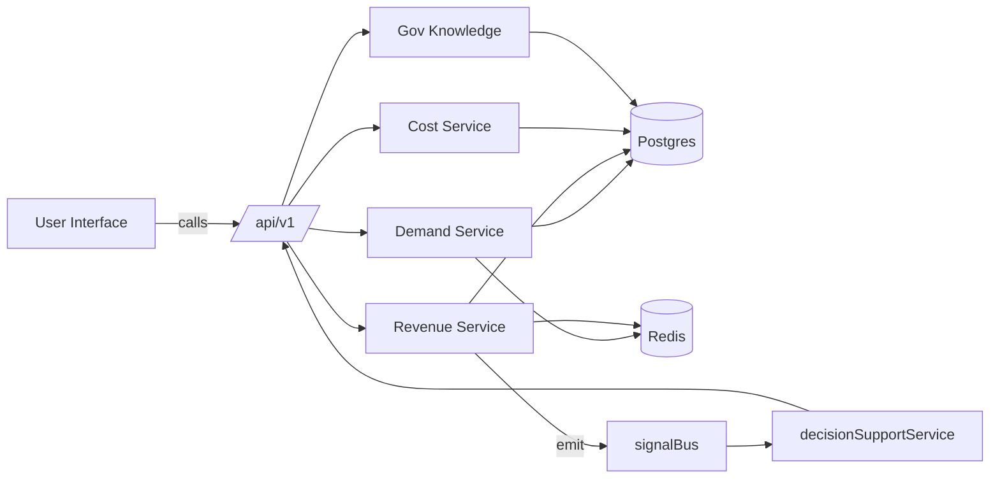

# Economic Layer — Initial Wireframes

This document contains concise screen descriptions and interaction flows for the Economic Layer MVP screens.

## 1. Dashboard — Economic Layer Overview
- KPI cards: Total Revenue (30d), Forecast Accuracy, Avg Cost per kg, Active Contracts
- Charts: Revenue by channel (stacked area), Forecast vs Actual (line)
- Quick Actions: Run Forecast, Create Contract, Run Channel Allocation

Layout (wireframe):
- Top bar: search, user, notifications
- Left nav: Overview, Revenue, Demand, Costs, Government, Village Twin
- Main: KPI row, Charts row, Recent Events feed

## 2. Revenue OS — Contracts List
- Table columns: Contract ID, Buyer, Seller Group, Products, Qty, Start/End, Status, Actions
- Actions: View, Edit, Apply Escrow, Close
- Modal: Create Contract (FPO selector, products, qty, price, escrow)

## 3. Demand Explorer
- Controls: product select, region select, date range
- Main: Forecast chart, Confidence band, Heatmap toggle
- Side: Scenario panel to add/remove drivers (festival, weather)

## 4. Government — Scheme Search & Eligibility
- Search box: free text + filters (state/district/sector)
- Results: scheme cards with name, benefit, eligibility summary
- Eligibility checker modal: user fields → server returns matched schemes + score

## 5. Village Digital Twin
- Header: village name, population, avg_income
- Tabs: Overview, Projects, Costs, Scenarios
- Projects: top-20 recommended with ROI estimate and status
- Scenario runner: change inputs (market price, yield) and simulate

## 6. Integration Flow (Mermaid)

## Component list (frontend)
- `EconomicDashboard` (cards, charts)
- `ContractsTable` (table + modals)
- `ForecastExplorer` (chart + heatmap)
- `SchemeSearch` (search + eligibility)
- `VillageTwin` (tabs + scenario)

## Accessibility & Localization
- All screens must support RTL/LTR and regional languages (i18n files)
- Charts: provide textual summaries for screen readers

## Next UI tasks
- Create storybook stories for each component
- Add basic scaffolding pages in `frontend/src/pages/economic/*`
- Wire components to mocked API endpoints for initial validation

---
Generated: 2026-08-05
