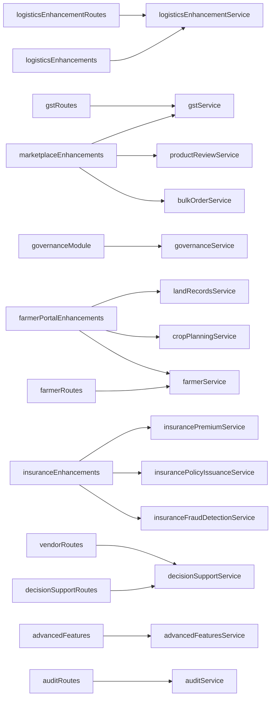

# Dependency Graph

**Generated:** 2026-08-04 by `tools/engineering-registry.js`
**Status:** DESCRIPTIVE — derived from code, not authored.
**Do not edit by hand.** Regenerate instead: `node tools/engineering-registry.js`

**Objects indexed:** 18

---

Service-to-service edges: **18**. Low coupling is intentional —
services communicate through the signal bus rather than direct requires.
