# EBDESIGN concept and implementation reconciliation

This is the design authority for the next implementation batches. It records the intended whole product, the existing code/library evidence, and the integration gaps. A file, route, UI card, or framework does not by itself prove a production workflow. The user's current all-India market direction supersedes older Nagaland-only or North-East-only launch wording; North-East supply and early corridor validation remain priorities.

## Product and operating model

Lumo Earth is a shared rural, agricultural and enterprise operating system. SVESCO is an execution partner, not a second technical platform. The economic unit is the farmer and household, connected to village, FPO, artisan/SHG, Panchayat, institutional buyer, supplier, carrier, service provider, financier and government operator. Market access is national in both directions: North-East and other-state producers can sell anywhere in India, while farmers and verified family members can buy household and agricultural inputs from any-state suppliers. Local delivery, licensing, subsidy, language and scheme coverage require separate jurisdiction-level verification; national market scope is not a claim that every corridor is operational.

The three economic levers are more production/value, lower total operating cost, and wider net revenue through market reach. Each proposed improvement must show its effect on quantity, quality, realized price, landed cost, working capital, risk and farmer share; gross price alone is insufficient. Nutrient/value pricing can sit beside conventional weight pricing, with measured yield, serving basis, lab quality, and transparent calculation.

```mermaid
flowchart LR
  A[Farmer, household, artisan, FPO] --> B[Village and district operations]
  B --> C[Production, quality, shared capacity]
  C --> D[National sell marketplace]
  D --> E[Buyer and institution]
  E --> F[Carrier, custody, delivery]
  F --> G[Invoice, GST, payment, accounting]
  G --> H[Outcomes and impact]
  I[National suppliers] --> J[Household and farm-input buy marketplace]
  J --> K[Buying club, FPO pooling, reverse freight]
  K --> A
  L[Library and external AI Backbone] --> M[Governed advice]
  N[Internal ERP agents and authority gate] --> O[Proposals and approved actions]
  M --> B
  O --> B
  H --> N
```

One transaction must cross domains through a stable identity, order/reservation, custody event, invoice and accounting reference. The sell and buy directions can share catalog, identity, checkout, carrier and ledger primitives, but retain their distinct eligibility, fulfillment and tax rules. The bidirectional corridor can reuse return capacity without assuming that a return truck, cold chain or subsidy is always available.

## Domain boundaries and workflow to build

| Boundary | Intended complete journey | Current evidence and design consequence |
|---|---|---|
| Farmer and household | Consented family delegation; production/income, needs and affordability; assisted access | `farmerFamilyRoutes.js`, `householdEconomyService.js`, `FarmerHouseholdDoorPage.jsx` exist; family purchase authority needs a verified link, not geography or shared surname. |
| National seller marketplace | Identity, origin, quality/certification, inventory, value/weight offers, browse, quote, commit, delivery, return/dispute | National coverage/listing origin and browse/edit were recently added. Checkout, corridor serviceability and end-to-end ERP closure remain open. |
| Reverse purchase marketplace | Household goods, seed, fertilizer, machinery, pipe/drip/pump, repair and second-life; compare any-state offers by delivered cost/time/quality; pooling and discounts | `householdProcurementService.js`, three buying-club services, `inputSupplyManagementService.js`, `returnLoadBoardService.js`, and landed-cost assets already overlap. Reconcile canonical contracts before introducing new offer/quote tables. Supplier discount is a quoted, effective-date term; government subsidy is separately verified eligibility. |
| Village/FPO/institution commerce | Demand pooling, village freelancer/craft orders, corporate RFQ/CSR, milestones, inspection, finance and delivery | Village and buying-club modules are discoverable; library M041 is `in_progress`, and its recorded routes show no auth requirement. Institutional foundation is partial. |
| Shared infrastructure and second life | Cold store, mobile/static processing, labs, machinery rental, inter-village capacity, asset repair/refurbishment/CSR resale | Reservation/ranking foundation is partial; conflict, cancellation, asset condition, warranty, safety and impact workflows are open. |
| Food, health and agronomy | MasterChef recipes, batch nutrition and costing, local seasonal availability, bundles; dietitian/NutriTest/therapy and animal/poultry/fish guidance with escalation; agriculturist/weather source and outturn scoring | Nutrition/recipe services and routes exist in parallel root/legacy/food namespaces. Seven-class governance binding exists; clinical/veterinary advice needs source, uncertainty and licensed-person escalation, never autonomous treatment. |
| Enterprise ERP and finance | Sales/procurement/inventory/quality/production/logistics/assets/HR events through double entry, GST, bank, credit, insurance, subsidy, period close and audit | Governed accounting/GST foundations are committed. The broader event-to-ledger and period-end chains are unverified; insurance quote/FNOL and subsidy assets are partial. Every financial action needs tenant, actor and segregation-of-duties evidence. |
| Science, engineering and advanced AI | University/government evidence monitor, scored forecasts, MEP calculations and licensed approval; robotics simulation/safety; quantum optimization with classical baseline | Scientist, robotics and quantum control planes exist; external quantum hardware/provider and real robot are unavailable. Prediction must be checked against actual outcome before promotion. |

## Shared knowledge, decision and operation contract

Every advisory or automated proposal should carry source authority and URI/file identity, content hash, retrieval date, effective period, state/district and season applicability, language, consent/privacy class, observed data and uncertainty, calculation/model version, alternatives, cost and service feasibility, decision owner, allowed autonomy, expected financial effect, and measured outcome. Public government rules and market prices need ongoing validation from authorized primary sources; no source can become a current statutory rate merely because it is in the library.

There are two deliberately separate AI layers. The external AI Backbone routes frontier/generative providers and must ground outputs in the library, protect data and record cost/provenance. The internal backbone is ERP sensation→proposal→authority→action→outcome, with 14 ERP domains. Seven capability classes constrain autonomy: frontier/generative/embodied/quantum advise, scientists observe, agentic actions need bounded authority, and security reflex may act only under verified pre-authorized thresholds with auditable reversal. Confidence text does not grant permission. Provider availability is an operational status, not an implementation claim.

Personalization is based on consented preferences and explicit selections for language, region, taste, dietary needs, occasion and culture, plus inventory, season and delivery feasibility. Religion cannot be inferred from location. Basic-phone IVR/SMS and assisted village operators must use the same account, permissions, price explanation and confirmation record as web/PWA, Capacitor Android and Tauri desktop. A responsive screen or mobile shell alone is not parity.

## Source authority and duplicate policy

The user master mandate and later user corrections define intent. `deep seek.txt` and `coding 2/3.txt` provide concepts and examples to validate, not executable requirements or proof of implementation; `coding 1.txt` is predominantly a path inventory according to the library gap analysis. The library's module identity, implementation map, fingerprints and function forensics help find and compare variants. Its module cards and knowledge graph report discovery status, which must be checked against code, routes, schema, auth, tests and a live workflow. The older `PROJECT_MANIFEST.md` and library completion summary are inventory snapshots, not release certificates.

Duplicate names are **not** junk merely because names repeat. For each family, record hash, exports/importers, mounted route, schema, behavior, tests and feature differences; select one canonical implementation; preserve unique behavior through explicit migration or compatibility delegate; verify import and workflow callers; then remove only proven redundant module-specific variants. `_ACTIVE_PROJECT`, `_UNIFIED_PROJECT` and `_MERGE_LAB` are historical/merge evidence until their lineage and retention role are settled. No bulk cleanup based on filename or age.

## Implementation sequence and release evidence

1. Complete a source-to-runtime matrix for the end-to-end sell and reverse-buy journeys, including family identity, buying club, farm inputs, landed cost, return load, subsidy, GST and accounting. Revise the uncommitted `10011_farmer_reverse_marketplace.sql` draft only after that matrix prevents duplicate product/quote ownership.
2. Make one thin national corridor complete: verified buyer/seller and supplier, actual published terms, pooled or individual demand, feasible freight and serviceability, governed checkout, fulfillment/custody, invoice/payment, accounting and dispute outcome. Expand states/corridors by evidence, not by a launch flag.
3. Extend the shared contract to institution/CSR, shared infrastructure, recipes/nutrition, insurance/subsidy and assisted channels with domain-specific safety and authority gates.
4. Reconcile remaining enterprise domains and AI classes against live outcomes; carry module-specific duplicate cleanup and regression verification with each completed batch.
5. Production certification requires PostgreSQL migration execution, negative security and financial reconciliation tests, browser/mobile/desktop/basic-phone journeys, accessibility/localization, monitoring, backup/restore, operational owner and release approval. The current backlog still reports 390 broken imports and about 1,623 placeholder detections requiring classification. No whole-project readiness percentage is credible from source counts alone.

Primary local sources: user master attachment `4785dd9e.../pasted-text.txt`; `Documents/deep seek.txt`, `coding 1/2/3.txt`; `_EBDESIGN_LIBRARY/04_AUTHORITY`, `01_MODULE_CARDS`, `16_AI_CONTEXT`; `docs/registry/22_MASTER_INDEX.md`, `CONCEPT_DOCUMENT_GAP_ANALYSIS_V2.md`; `docs/PRODUCT_ECOSYSTEM_BLUEPRINT.md`, `ENTERPRISE_CONTROL_LAYER.md`, `PRODUCTION_COMPLETION_TODO.md`, `NATIONAL_MARKETPLACE_SCOPE.md`, `ai-erp-capability-evidence-20260915.md`.
